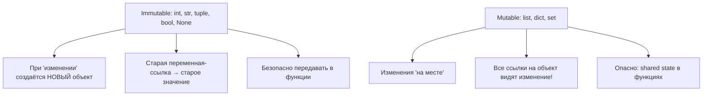
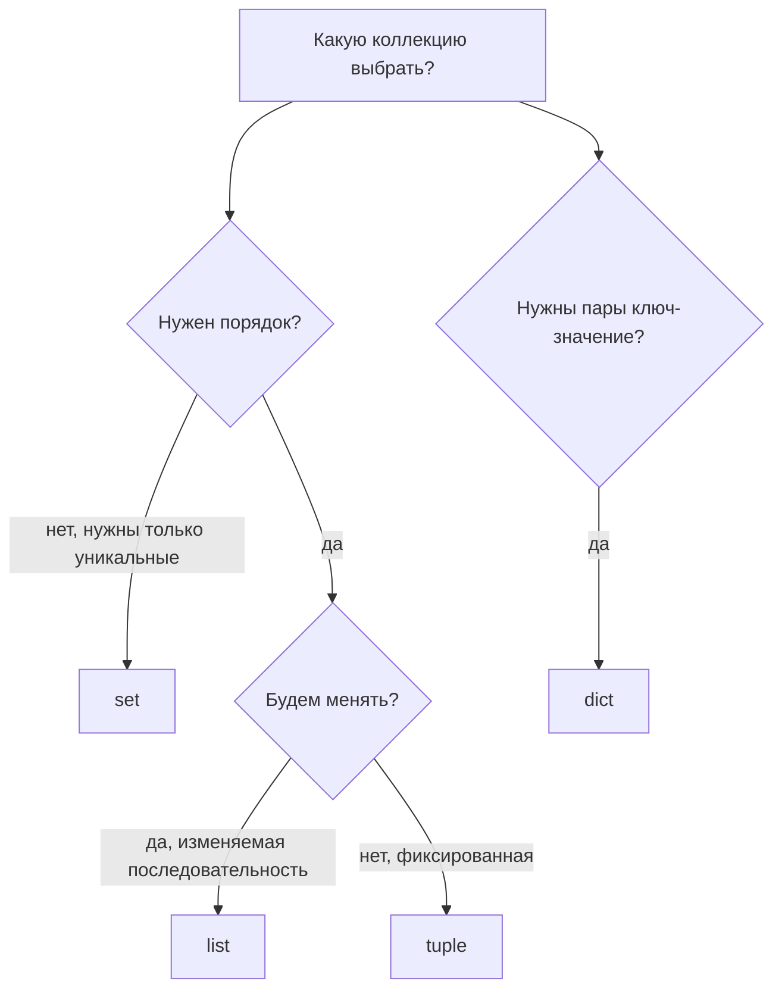
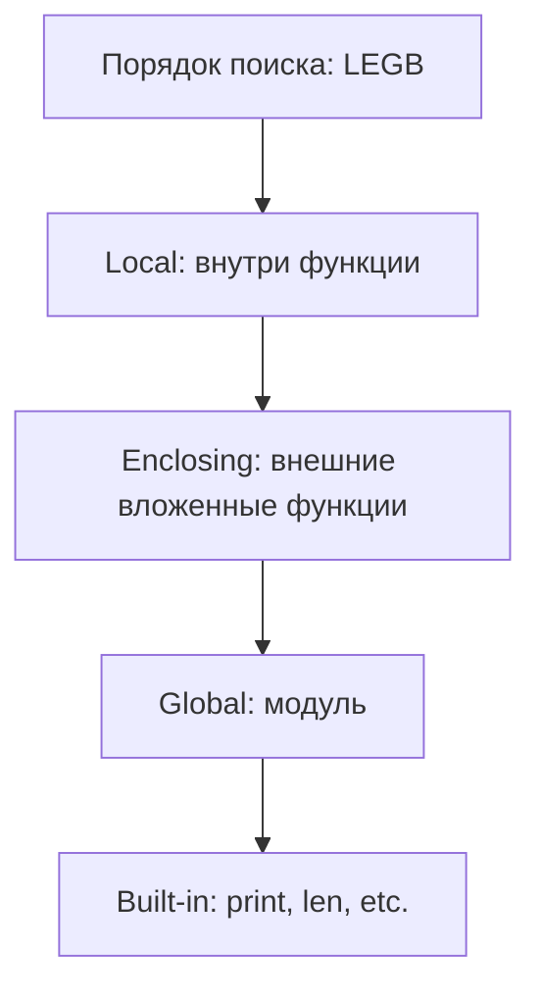
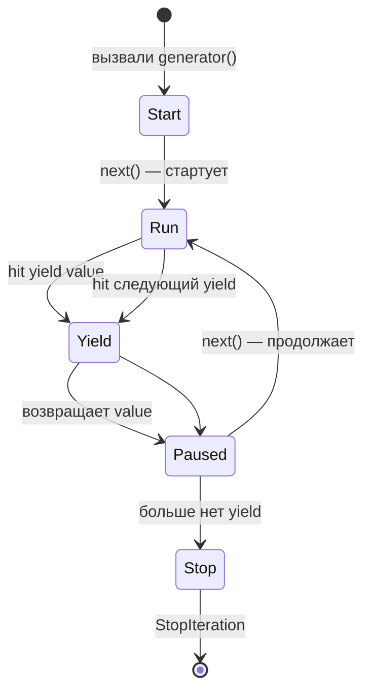
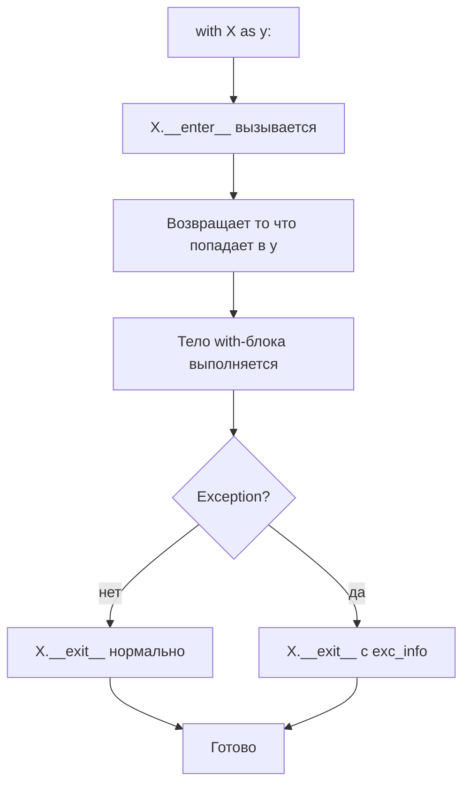
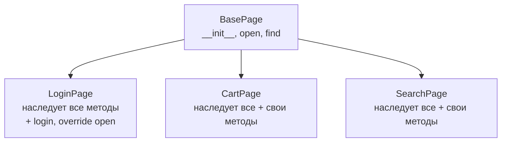
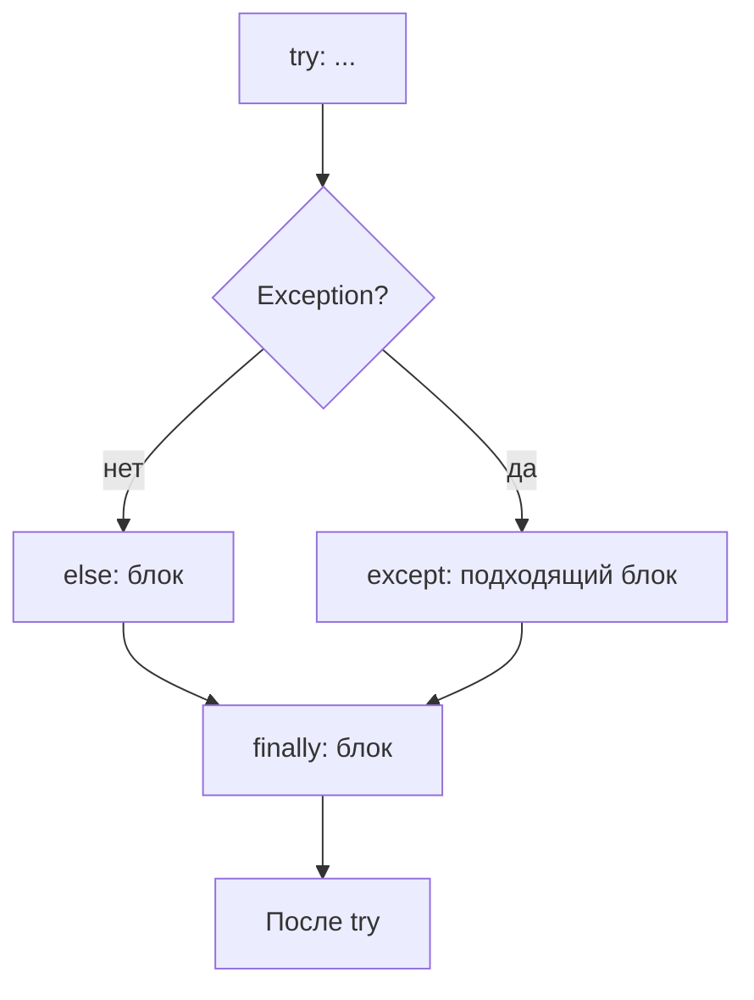

# Блок 0 / 11 — Python (фундамент, на котором стоит всё)

> Это не «учим Python с нуля». Это **6 механизмов языка, из которых физически сделаны все твои инструменты тестирования.** Поймёшь их — и pytest, httpx, Allure, Locust перестанут быть набором заклинаний.
> Формат как в [API-уроке (Блок 3)](03-api-testing.md): идея → как работает под капотом → как всплывает в твоих тестах.

---

## 0. Общая картина — карта ВСЕХ блоков (повесь в голове один раз)

Прежде чем учить что-либо, разложим **единый хребет**, на который ляжет каждый следующий урок. Это и есть та «целостная картина»: если её держать в голове, ни одна тема не висит в воздухе, а если что-то забыл на собесе — **достаёшь из соседнего блока** и доводишь рассуждением.

Вся работа AQA — это конвейер: «надо проверить продукт» → «зелёный прогон + понятный отчёт». Шесть звеньев:

```
  ЯЗЫК          КАРКАС          ЧТО ПРОВЕРЯЕМ            КАК ПОКАЗЫВАЕМ    ГДЕ КРУТИТСЯ      КАК ПРОДАЁМ
  Python   →    Pytest     →    API·UI·Load·       →    Allure       →   CI/CD · Infra →   Теория·STAR·
  (Блок 0)      (Блок 1)        Messaging·SQL           (Блок 2)         (Блоки 8,9)       Легенда (10,11)
                                (Блоки 3,4,5,6,7)
```

| Звено | Блок(и) | Роль одним словом |
|---|---|---|
| **Язык** | 0 | Из чего всё сделано — 6 механизмов Python |
| **Каркас** | 1 (Pytest) | Дирижёр: запускает тесты, кормит фикстурами, размножает параметризацией |
| **Что проверяем** | 3 API · 4 UI · 5 Load · 6 Messaging · 7 SQL | Инструменты по слоям тестирования — каждый закрывает свой слой проверки (см. таблицу слоёв в API-уроке §0) |
| **Как показываем** | 2 (Allure) | Отчёт: шаги, вложения, категории |
| **Где крутится** | 8 CI/CD · 9 Infra | Автоматический прогон + железо/сеть/Docker |
| **Как продаём** | 10 Теория/STAR · 11 Легенда/English | Объяснить, рассказать кейс, защитить опыт |

**Как этим пользоваться на собесе (твоя суперсила «знаний рядом»):** забыл деталь — не молчишь, а выводишь из соседа.
- *Забыл, что такое фикстура (Блок 1)?* → «Это генератор из Блока 0: `yield` ставит на паузу, до него setup, после — teardown.»
- *Забыл, как работает async (Блок 3)?* → «Корутина — родственник генератора из Блока 0; `await` это как `yield`, только отдаёт управление, а не значение.»
- *Забыл, зачем Pydantic (Блок 3)?* → «Это type hints из Блока 0, которые наконец-то реально проверяются.»

Всё сходится в Блок 0. Поэтому он — первый.

### Из чего сделаны твои инструменты — 6 механизмов

Главная таблица блока. Каждая строка: «видишь в тест-коде X — под капотом это механизм Python отсюда»:

| Механизм Python (раздел) | Где встречаешь | Блок |
|---|---|---|
| **Декоратор** (§6) | `@pytest.fixture`, `@pytest.mark.parametrize`, `@allure.step`, `@task` в Locust | 1, 2, 5 |
| **Генератор / `yield`** (§7) | `yield` в фикстуре (setup/teardown), курсор БД, чтение больших файлов | 1, 7 |
| **Context manager / `with`** (§8) | `with httpx.Client()`, `with testcontainers…()`, `with allure.step()`, `with pytest.raises()` | 3, 6, 2 |
| **Классы / наследование** (§9) | POM (`BasePage`), API-клиент (`APIClientBase`) | 4, 3 |
| **async / await** (§12) | `httpx.AsyncClient`, массовые одновременные запросы, нагрузка | 3, 5 |
| **Type hints** (§10) | Pydantic-модели как контракт ответа API | 3 |

Щёлкнут эти 6 — дальше ты не зубришь синтаксис, а узнаёшь знакомое в новой обёртке. Остальное (типы, коллекции, стандартная библиотека) — **справочник**: читай по диагонали, возвращайся по надобности.

---

## Карта блока

1. Базовый синтаксис и типы данных
2. Строки и f-strings (форматирование)
3. Коллекции — list, dict, set, tuple
4. Управление потоком — if / for / while / break / continue
5. Функции — args, kwargs, scope, замыкания
6. **Декораторы** — глубоко (это и есть pytest)
7. **Генераторы и `yield`** — глубоко (это setup/teardown)
8. **Context managers (`with`)** — глубоко (это testcontainers)
9. **Классы и OOP** — POM-уровень
10. Type hints + Pydantic preview
11. Обработка ошибок — try / except / finally / raise
12. **Async / await** — что и зачем
13. Стандартная библиотека для тестов
14. Файлы и pathlib
15. Common idioms — как пишет «питонист»

---

## 1. Базовый синтаксис и типы данных

### Переменные — Python динамически типизированный

```python
# Тип определяется автоматически при присвоении
x = 5                          # int
x = "hello"                    # теперь str — это нормально в Python

# Можно подсказать тип (но НЕ принуждение, см. раздел 10)
age: int = 30
name: str = "Alice"

# Множественное присвоение
a, b, c = 1, 2, 3              # a=1, b=2, c=3
x = y = z = 0                  # все три = 0
```

### Основные типы

| Тип | Пример | Mutable (изменяемый)? |
|---|---|---|
| `int` | `42`, `-7`, `0` | нет |
| `float` | `3.14`, `1e-5` | нет |
| `str` | `"hello"`, `'world'` | **нет** (важно!) |
| `bool` | `True`, `False` | нет |
| `None` | `None` | нет |
| `list` | `[1, 2, 3]` | **да** |
| `tuple` | `(1, 2, 3)` | нет |
| `dict` | `{"a": 1}` | **да** |
| `set` | `{1, 2, 3}` | **да** |
| `bytes` | `b"hello"` | нет |

### Mutable vs Immutable — главный подвох

```python
# Immutable — изменить нельзя, можно только создать новый
s = "hello"
s[0] = "H"                     # ❌ TypeError: 'str' object does not support item assignment
s = "Hello"                    # ✅ создали новую строку и переприсвоили

# Mutable — изменяется в памяти "на месте"
lst = [1, 2, 3]
lst[0] = 99                    # ✅ lst = [99, 2, 3] — тот же объект, изменён
lst.append(4)                  # ✅ lst = [99, 2, 3, 4]
```



### Частая ошибка с mutable

```python
def add_item(item, items=[]):                   # ❌ default = mutable
    items.append(item)
    return items

print(add_item("a"))           # ['a']
print(add_item("b"))           # ['a', 'b']    ← НЕ ['b']! shared default
print(add_item("c"))           # ['a', 'b', 'c'] ← всё хуже

# Правильно:
def add_item(item, items=None):
    if items is None:
        items = []                              # создаём новый каждый вызов
    items.append(item)
    return items
```

> **На собесе:** «default-аргумент с mutable объектом» — классический трик-вопрос. Знание = senior.

### Сравнение типов

```python
type(x)                                          # <class 'int'>
type(x) is int                                   # True/False
isinstance(x, int)                               # True/False — лучше для проверки
isinstance(x, (int, float))                      # True если int ИЛИ float

# В тестах часто:
assert isinstance(response, dict)
```

### `None` — это объект, не "ничего"

```python
x = None
x is None                                        # ✅ ПРАВИЛЬНО (рекомендуется)
x == None                                        # ⚠️ работает, но lint предупредит

# Зачем `is` а не `==`?
# `is` — сравнивает по identity (тот же объект в памяти)
# `==` — сравнивает по равенству (может быть переопределён через __eq__)
# None — singleton, только один на всю программу, поэтому `is` корректно и быстрее
```

---

**На собесе спросят:** «Чем отличаются `is` и `==`? Когда что использовать?»
**Стоит отвечать так:** `is` — сравнение **по identity** (это **тот же** объект в памяти). `==` — сравнение **по значению** (могут быть разные объекты с одинаковым значением). Правило: `is` для **синглтонов** (`None`, `True`, `False`), везде остальное — `==`. Пример: `x is None` ✅, `x == None` ⚠️ — работает но lint жалуется, потому что в теории кто-то мог переопределить `__eq__` так что `x == None` дало True для не-None объекта.
**Почему так:** базовый Python-вопрос, плыть нельзя.

---

## 2. Строки и f-strings

### Создание строк

```python
s1 = 'hello'                                     # одинарные
s2 = "hello"                                     # двойные — одинаково
s3 = """multi
line
string"""                                         # многострочная
s4 = 'It\'s OK'                                  # escape
s5 = r'C:\Users\test'                            # raw string — \ не escape
s6 = b'bytes'                                    # bytes (для бинарных данных)
```

### f-strings (Python 3.6+) — современный стандарт

```python
name = "Alice"
age = 30

# Старые способы (не используй)
print("Hello, " + name + ", age " + str(age))    # конкатенация
print("Hello, %s, age %d" % (name, age))         # %-форматирование
print("Hello, {}, age {}".format(name, age))     # .format()

# Современный — f-strings
print(f"Hello, {name}, age {age}")               # Hello, Alice, age 30

# Внутри f-string — любые выражения
print(f"Next year: {age + 1}")                   # Next year: 31
print(f"Upper: {name.upper()}")                  # Upper: ALICE
print(f"List: {[1, 2, 3]}")                      # List: [1, 2, 3]
```

### Форматирование значений

```python
# Числа после двоеточия — спецификация формата
f"Price: {99.5:.2f}"                              # 'Price: 99.50' — 2 знака после точки
f"Percent: {0.85:.1%}"                            # 'Percent: 85.0%'
f"Padded: {42:>5}"                                # 'Padded:    42' — правое выравнивание
f"Left: {42:<5}"                                  # 'Left: 42   '
f"Zero-pad: {7:04d}"                              # 'Zero-pad: 0007'

# Repr через !r — для отладки видны кавычки и тип
f"name={name!r}"                                  # "name='Alice'" — видны кавычки

# = для дебага (Python 3.8+)
x = 42
print(f"{x=}")                                    # "x=42" — печатает имя + значение
print(f"{x + 1=}")                                # "x + 1=43"
```

### Полезные методы строк

```python
s = "  Hello, World  "

s.strip()                                         # 'Hello, World' — обрезать пробелы
s.lstrip(), s.rstrip()                            # только слева / справа
s.lower(), s.upper()                              # 'hello, world', 'HELLO, WORLD'
s.replace("World", "Python")                      # 'Hello, Python'
s.split(",")                                      # ['  Hello', ' World  '] — список
",".join(["a", "b", "c"])                         # 'a,b,c'
"hello".startswith("he")                          # True
"hello".endswith("lo")                            # True
"hello".find("l")                                 # 2 (индекс первой 'l')
"hello".count("l")                                # 2
len("hello")                                      # 5

# Срезы (slicing)
s = "Hello"
s[0]                                              # 'H'
s[-1]                                             # 'o' — отрицательные с конца
s[0:3]                                            # 'Hel' — от 0 до 3 (не включая)
s[:3]                                             # 'Hel'
s[2:]                                             # 'llo'
s[::-1]                                           # 'olleH' — реверс
s[::2]                                            # 'Hlo' — каждый 2-й
```

---

## 3. Коллекции — list, dict, set, tuple

### list — список (mutable, упорядоченный)

```python
# Создание
lst = [1, 2, 3]
lst = list()                                      # пустой
lst = [x * 2 for x in range(5)]                   # comprehension → [0, 2, 4, 6, 8]

# Доступ
lst[0]                                            # первый
lst[-1]                                           # последний
lst[1:3]                                          # срез

# Изменение
lst.append(99)                                    # добавить в конец
lst.insert(0, 99)                                 # вставить в позицию 0
lst.remove(99)                                    # удалить ПЕРВОЕ вхождение
lst.pop()                                         # удалить и вернуть последний
lst.pop(0)                                        # удалить и вернуть по индексу
lst.extend([4, 5, 6])                             # добавить элементы из другого списка
lst.sort()                                        # отсортировать НА МЕСТЕ (in-place)
sorted(lst)                                       # вернуть НОВЫЙ отсортированный
lst.reverse()                                     # реверс на месте

# Проверки
3 in lst                                          # True/False
len(lst)                                          # длина
lst.count(3)                                      # сколько раз встречается
lst.index(3)                                      # индекс первого вхождения
```

### dict — словарь (mutable, упорядоченный с Python 3.7)

```python
# Создание
d = {"name": "Alice", "age": 30}
d = dict(name="Alice", age=30)                    # эквивалент
d = {x: x**2 for x in range(5)}                   # comprehension → {0:0, 1:1, 2:4, 3:9, 4:16}

# Доступ
d["name"]                                         # 'Alice'
d.get("name")                                     # 'Alice'
d.get("missing")                                  # None (не упадёт)
d.get("missing", "default")                       # 'default'

# Изменение
d["email"] = "a@x.com"                            # добавить / обновить
d.update({"age": 31, "role": "admin"})            # merge dict
del d["name"]                                     # удалить ключ
d.pop("age")                                      # удалить и вернуть
d.pop("missing", None)                            # с дефолтом, не упадёт

# Итерация
for key in d:                                     # по ключам
    print(key)

for key, value in d.items():                      # по парам
    print(f"{key}: {value}")

for value in d.values():                          # только значения
    print(value)

# Merge (Python 3.9+)
d1 = {"a": 1}
d2 = {"b": 2}
merged = d1 | d2                                  # {'a': 1, 'b': 2}
d1 |= d2                                          # in-place merge

# Проверки
"name" in d                                       # True (проверка по КЛЮЧУ)
len(d)                                            # число пар
```

### set — множество (mutable, без дубликатов, неупорядоченный)

```python
s = {1, 2, 3}
s = set([1, 2, 2, 3, 3])                          # {1, 2, 3} — дубликаты убраны
s = set()                                         # ⚠️ пустое — set(), НЕ {} (это пустой dict!)

# Операции
s.add(4)                                          # добавить
s.remove(4)                                       # удалить (KeyError если нет)
s.discard(4)                                      # удалить (не упадёт)
s.update({5, 6})                                  # merge

# Set-операции
a = {1, 2, 3}
b = {2, 3, 4}
a | b                                             # объединение {1, 2, 3, 4}
a & b                                             # пересечение {2, 3}
a - b                                             # разница {1}
a ^ b                                             # симметрическая разница {1, 4}
```

### tuple — кортеж (immutable, упорядоченный)

```python
t = (1, 2, 3)
t = 1, 2, 3                                       # тоже tuple — скобки опциональны
t = (1,)                                          # один элемент — обязательно запятая!
t = ()                                            # пустой

# Доступ
t[0]                                              # как у list

# Изменить НЕЛЬЗЯ
t[0] = 99                                         # ❌ TypeError

# Распаковка (важно!)
x, y, z = (1, 2, 3)                               # x=1, y=2, z=3
a, b = b, a                                       # swap — обмен значениями

# Tuple для возврата нескольких значений из функции
def get_user():
    return "Alice", 30, "admin"

name, age, role = get_user()                      # распаковка
```



> ### ❗ Разбор собеса (2026-07, mayflower)
> Вопрос «в чём разница list/set/tuple» — назвал только «изменяемый/неизменяемый/неупорядоченный» и завис на 1.5 минуты. Для senior этого мало — не прозвучало главное: **зачем set вообще нужен** и **почему tuple может быть ключом**. Ниже — что называть.

**Senior-разница (не только mutable/ordered):**

| | mutable | упорядочен | дубликаты | хэшируемый (ключ dict / элемент set) | поиск `x in ...` |
|---|:---:|:---:|:---:|:---:|:---:|
| **list** | да | да | да | **нет** | O(n) |
| **tuple** | нет | да | да | **да** (если внутри только хэшируемое) | O(n) |
| **set** | да | нет | **нет** | сам — нет; элементы обязаны быть | **O(1)** |
| **dict** | да | да (3.7+) | ключи уникальны | ключи обязаны быть | O(1) по ключу |

**Три вещи, ради которых существует set (и которые надо назвать):**
1. **Уникальность** — дубликаты выкидываются автоматически (`set([1,1,2]) → {1,2}`).
2. **Поиск за O(1)** — `x in my_set` мгновенно против O(n) у списка. На больших данных это причина №1 брать set.
3. Быстрые операции множеств — `&` (пересечение), `-` (разница): «какие ожидаемые ID пропали в ответе» = `expected - actual`.

**Почему tuple может быть ключом dict, а list — нет:** ключ должен быть **хэшируемым** (неизменяемым по хэшу). tuple неизменяем → хэшируем. list изменяем → нет. Классический follow-up.

**Поверхностная неизменяемость tuple (ловушка на собесе):** tuple неизменяем **на верхнем уровне**. Если внутри лежит list — его содержимое менять можно:
```python
t = (1, [2, 3])
t[1].append(4)        # OK → (1, [2, 3, 4])   ← сам список мутабелен
t[0] = 99             # ❌ TypeError            ← ссылку в кортеже поменять нельзя
# и tuple с list внутри УЖЕ не хэшируем → ключом dict быть не может
```

**На собесе спросят:** «Разница list/set/tuple? Почему tuple ключом можно, а list нет?»
**Отвечать так:** mutable/ordered/дубликаты → **set ради уникальности + O(1) поиска** → tuple хэшируем → ключ dict → упомянуть поверхностную неизменяемость.
**Почему так:** ровно то, где на записи была полутораминутная пауза. Проговорить вслух.

### Comprehensions — лаконичный синтаксис

```python
# List comprehension — [выражение for x in iterable if условие]
squares = [x**2 for x in range(5)]                # [0, 1, 4, 9, 16]
evens = [x for x in range(10) if x % 2 == 0]      # [0, 2, 4, 6, 8]

# Dict comprehension
by_id = {user["id"]: user for user in users}     # mapping id → user

# Set comprehension
unique = {x.lower() for x in words}

# Generator expression — () вместо []
# НЕ создаёт список, выдаёт по одному (ленивая итерация)
gen = (x**2 for x in range(1_000_000))            # не жрёт RAM
total = sum(x**2 for x in range(1_000_000))       # часто внутри функций
```

---

**На собесе спросят:** «В чём разница между `[x for x in range(N)]` и `(x for x in range(N))`?»
**Стоит отвечать так:** `[...]` создаёт **list** — весь список сразу в памяти. `(...)` создаёт **generator** — выдаёт элементы **по одному** при итерации, не хранит весь список в памяти. На больших данных (миллион записей) генератор использует константную память, list упадёт по OOM. Часто пишут `sum(x**2 for x in range(1_000_000))` — скобки даже не нужны, sum принимает iterable. Senior-практика: list когда нужны все элементы сразу (random access, len), generator когда итерация одноразовая (для пайплайна обработки).
**Почему так:** проверяет понимание lazy evaluation. Junior пишет везде list, Senior — выбирает осознанно.

---

## 4. Управление потоком

### if / elif / else

```python
age = 25

if age < 18:
    print("minor")
elif age < 65:
    print("adult")
else:
    print("senior")

# Тернарный оператор
status = "adult" if age >= 18 else "minor"

# Walrus := (Python 3.8+) — присвоение внутри условия
if (n := len(items)) > 10:
    print(f"Too many: {n}")                       # n уже доступна
```

### for — итерация

```python
# По коллекции
for item in [1, 2, 3]:
    print(item)

# По range
for i in range(5):                                # 0, 1, 2, 3, 4
    print(i)
for i in range(2, 8):                             # 2, 3, 4, 5, 6, 7
    print(i)
for i in range(0, 10, 2):                         # 0, 2, 4, 6, 8 (шаг 2)
    print(i)

# По словарю
for key in d:                                     # по ключам
    pass
for key, value in d.items():                      # по парам
    pass

# С индексом — enumerate
for i, item in enumerate(["a", "b", "c"]):
    print(i, item)                                # 0 a, 1 b, 2 c

# Параллельная итерация — zip
names = ["Alice", "Bob"]
ages = [30, 25]
for name, age in zip(names, ages):
    print(name, age)                              # Alice 30, Bob 25

# Реверс — reversed
for x in reversed([1, 2, 3]):                     # 3, 2, 1
    print(x)
```

### while

```python
i = 0
while i < 5:
    print(i)
    i += 1

# Polling-паттерн (часто в тестах для wait_for)
import time
deadline = time.time() + 10
while time.time() < deadline:
    if check_condition():
        break
    time.sleep(0.5)
else:
    raise TimeoutError("condition not met")        # ← else на циклах!
```

### `else` на цикле — редкая фишка

```python
for x in [1, 2, 3]:
    if x == 99:
        print("found!")
        break
else:
    print("not found")                            # ← выполнится если break НЕ сработал
```

Не самая используемая фишка, но **знать стоит** — может попасться как трик-вопрос.

### break / continue

```python
for x in range(10):
    if x == 5:
        break                                     # выход из цикла
    if x % 2 == 0:
        continue                                  # к следующей итерации
    print(x)                                      # 1, 3
```

---

## 5. Функции

### Базовое

```python
def greet(name):
    return f"Hello, {name}"

print(greet("Alice"))                             # 'Hello, Alice'
```

### Аргументы — много вариантов

```python
# Позиционные
def add(a, b):
    return a + b
add(1, 2)                                         # 3

# Именованные (kwargs)
add(a=1, b=2)                                     # 3
add(b=2, a=1)                                     # 3 — порядок не важен

# Дефолтные значения
def greet(name, greeting="Hello"):
    return f"{greeting}, {name}"
greet("Alice")                                    # 'Hello, Alice'
greet("Alice", greeting="Hi")                     # 'Hi, Alice'

# *args — переменное число позиционных
def sum_all(*numbers):                            # numbers — это tuple
    return sum(numbers)
sum_all(1, 2, 3, 4)                               # 10

# **kwargs — переменное число именованных
def make_user(**fields):                          # fields — это dict
    return fields
make_user(name="Alice", age=30)                   # {'name': 'Alice', 'age': 30}

# Всё вместе (порядок важен!)
def universal(pos1, pos2, *args, key1="default", **kwargs):
    pass
```

### Распаковка при вызове

```python
def add(a, b, c):
    return a + b + c

# Распаковка списка/кортежа в позиционные через *
args = [1, 2, 3]
add(*args)                                        # = add(1, 2, 3) = 6

# Распаковка словаря в kwargs через **
kwargs = {"a": 1, "b": 2, "c": 3}
add(**kwargs)                                     # = add(a=1, b=2, c=3) = 6

# Это и есть driver.find_element(*locator) в Selenium!
locator = (By.ID, "submit")
driver.find_element(*locator)                     # = find_element(By.ID, "submit")
```

### Возврат нескольких значений

```python
def get_user_info():
    return "Alice", 30, "admin"                   # tuple

name, age, role = get_user_info()                 # распаковка
name, *rest = get_user_info()                     # name='Alice', rest=[30, 'admin']

# Или возврат dict для большего числа полей
def get_user_info():
    return {"name": "Alice", "age": 30, "role": "admin"}

user = get_user_info()
user["name"]
```

### Scope — где живёт переменная

```python
x = 10                                            # global scope

def outer():
    y = 20                                        # enclosing scope (для inner)
    def inner():
        z = 30                                    # local scope inner
        print(x, y, z)                            # 10, 20, 30 — видит все
    inner()

outer()
```



### `global` и `nonlocal`

```python
count = 0

def increment():
    global count                                  # ← без этого ниже создастся локальная
    count += 1

increment()                                       # count = 1

# nonlocal — для enclosing scope (не global)
def outer():
    x = 0
    def inner():
        nonlocal x                                # ← модифицируем x из outer
        x += 1
    inner()
    return x                                      # 1
```

> **В тестах:** избегай `global` — он делает тесты непредсказуемыми (shared state). Используй фикстуры.

### Замыкания (closures) — это под капотом декораторов

```python
def make_multiplier(factor):
    """Возвращает функцию, которая помнит factor."""
    def multiply(x):
        return x * factor                         # ← factor из enclosing scope "захвачен"
    return multiply

double = make_multiplier(2)                       # double "помнит" factor=2
triple = make_multiplier(3)                       # triple "помнит" factor=3

double(5)                                         # 10
triple(5)                                         # 15
```

Это и есть **замыкание** — функция плюс окружение (значения переменных) которое она «захватила».

---

**На собесе спросят:** «Что напечатает этот код?»
```python
def make_multiplier(factor):
    def multiply(x):
        return x * factor
    return multiply

double = make_multiplier(2)
triple = make_multiplier(3)
print(double(5), triple(5))
```
**Стоит отвечать так:** `10 15`. Это **замыкание** — функция `multiply` запомнила значение `factor` из своего enclosing scope. `double` помнит `factor=2`, `triple` помнит `factor=3`. Каждый вызов `make_multiplier` создаёт новый scope, поэтому `factor` у `double` и `triple` разные. Это и есть **механизм под капотом декораторов** в Python.
**Почему так:** базовый вопрос по closures. Junior часто отвечает «10 10» или путается.

---

## 6. Декораторы — глубоко

**Это ядро всего AQA-кода.** `@pytest.fixture`, `@pytest.mark.parametrize`, `@allure.step`, `@pytest.mark.asyncio` — всё декораторы.

### Что декоратор делает физически

Декоратор — это **функция которая принимает функцию и возвращает (обычно изменённую) функцию**.

```python
# Это:
@my_decorator
def my_func():
    pass

# Эквивалентно этому:
def my_func():
    pass
my_func = my_decorator(my_func)
```

То есть `@decorator` — это **синтаксический сахар**. Под капотом — присваивание.

### Минимальный пример — пошагово

```python
# Шаг 1: определяем декоратор
def log_calls(func):
    """Декоратор: печатает имя функции до и после вызова."""

    # Шаг 2: внутри декоратора — wrapper
    def wrapper(*args, **kwargs):                # принимает любые аргументы
        print(f"Calling {func.__name__}")
        result = func(*args, **kwargs)           # вызываем оригинальную функцию
        print(f"Done {func.__name__}")
        return result                            # возвращаем её результат

    # Шаг 3: декоратор возвращает обёртку
    return wrapper


# Шаг 4: применяем декоратор
@log_calls
def add(a, b):
    return a + b

# Эквивалент: add = log_calls(add)
# Теперь add — это уже wrapper, не оригинальная функция

add(2, 3)
# Calling add
# Done add
# Возвращает: 5
```

```mermaid
graph TD
    Apply[@log_calls применяется к add]
    Apply --> Step1[Шаг 1: log_calls add вызывается]
    Step1 --> Step2[Шаг 2: внутри создаётся wrapper, замыкая func=add]
    Step2 --> Step3[Шаг 3: возвращается wrapper]
    Step3 --> Step4[Шаг 4: add = wrapper - перепривязка имени]
    Step4 --> Result[Теперь add - это wrapper, который внутри зовёт оригинал]
```

**Ключевые моменты:**
- `wrapper(*args, **kwargs)` — принимаем **любые** аргументы и пробрасываем в `func`
- `func.__name__` — мета-инфо об оригинальной функции
- Возвращаем **новую** функцию (`wrapper`), которая займёт место `add`

### Декораторы с аргументами

```python
# Декоратор-фабрика: возвращает декоратор
def repeat(times):
    """Это НЕ декоратор. Это ФАБРИКА которая возвращает декоратор."""
    def decorator(func):                         # ← вот это декоратор
        def wrapper(*args, **kwargs):            # ← вот это обёртка
            for _ in range(times):
                result = func(*args, **kwargs)
            return result
        return wrapper
    return decorator                              # ← возвращаем декоратор

@repeat(3)
def greet():
    print("Hi")

greet()
# Hi
# Hi
# Hi
```

**Как читать `@repeat(3)`:**
1. `repeat(3)` вызывается → возвращает `decorator` (замкнул `times=3`)
2. `decorator(greet)` вызывается → возвращает `wrapper`
3. `greet = wrapper`

Это и есть `@pytest.fixture(scope="session")` — `pytest.fixture` это **фабрика** декораторов.

### Что это значит для pytest

```python
# pytest.fixture без аргументов — обычный декоратор
@pytest.fixture
def api_client():
    return httpx.Client()

# pytest.fixture(...) — декоратор-фабрика
@pytest.fixture(scope="session", autouse=True)
def db():
    return connect()

# pytest.mark.parametrize — тоже фабрика
@pytest.mark.parametrize("x,y", [(1, 2), (3, 4)])
def test_add(x, y):
    ...
```

> ### ❗ Разбор собеса (2026-07, ecommpay) — «декоратор ≠ фикстура»
> Сказал «декораторы в целом — это и есть фикстуры». **Неверно, это перепутанные понятия.** Head of QA на техничке поймает. Разводить чётко:
>
> - **Декоратор** — общий механизм языка Python: функция, которая оборачивает другую и меняет/дополняет её поведение (`@repeat`, `@timer`, `@functools.wraps`). Работает с любой функцией.
> - **Фикстура** — механизм именно **pytest** для setup/teardown и передачи зависимостей в тест (`@pytest.fixture` + `yield`). Тест получает её, объявив в аргументах.
> - **Связь (вот что сбило):** `@pytest.fixture` **реализована** через декоратор — но это как «дом сделан из кирпича»: дом ≠ кирпич. Декоратор — стройматериал, фикстура — конкретная конструкция pytest на нём.
>
> **Формулировка на собес:** «Декоратор — обёртка функции, механизм самого Python. Фикстура — сущность pytest для setup/teardown, она реализована *через* декоратор `@pytest.fixture`, но это не синонимы.»

### Декораторы стекаются

```python
@allure.epic("Billing")
@allure.feature("Payments")
@allure.title("Charge 100 USD")
@pytest.mark.smoke
@pytest.mark.parametrize("amount", [100, 200])
def test_charge(amount):
    ...
```

**Порядок применения — снизу вверх.** Самый ближний к функции декоратор применяется первым.

### Когда сам пишешь декоратор для AQA

```python
import functools
import time
from typing import Callable

def retry_on_failure(times: int = 3, delay: float = 1.0):
    """Перезапускает функцию если упала — для нестабильных интеграций."""

    def decorator(func: Callable) -> Callable:
        @functools.wraps(func)                    # ← сохраняет __name__/__doc__ оригинала
        def wrapper(*args, **kwargs):
            for attempt in range(times):
                try:
                    return func(*args, **kwargs)
                except Exception as e:
                    if attempt == times - 1:
                        raise                     # последняя попытка — пробрасываем
                    print(f"Attempt {attempt+1} failed: {e}, retrying...")
                    time.sleep(delay)
        return wrapper
    return decorator

@retry_on_failure(times=3, delay=2.0)
def test_unstable_external_api():
    ...
```

> `@functools.wraps(func)` — **обязательно** в кастомных декораторах. Без него теряется имя функции (`wrapper.__name__` будет `'wrapper'` вместо `'test_unstable_external_api'`) и pytest начнёт глючить, traceback показывать «wrapper» вместо реального имени теста.

### Класс-декоратор (бонус)

Декоратор можно сделать и классом — через `__call__`:

```python
class Retry:
    def __init__(self, times):
        self.times = times

    def __call__(self, func):
        @functools.wraps(func)
        def wrapper(*args, **kwargs):
            for _ in range(self.times):
                try:
                    return func(*args, **kwargs)
                except Exception:
                    continue
            raise
        return wrapper

@Retry(times=3)
def fragile():
    ...
```

Используется реже, но **может попасться в чужом коде**.

---

**На собесе спросят:** «Напиши декоратор `@measure_time` который замеряет время выполнения функции.»
**Стоит отвечать так:**
```python
import functools, time

def measure_time(func):
    @functools.wraps(func)                       # обязательно — сохраняет имя
    def wrapper(*args, **kwargs):                # принимает любые аргументы
        start = time.time()
        result = func(*args, **kwargs)
        elapsed = time.time() - start
        print(f"{func.__name__} took {elapsed:.3f}s")
        return result                            # ВАЖНО — вернуть результат оригинала
    return wrapper
```
Ключевые моменты: (1) `*args, **kwargs` чтобы работало с любыми сигнатурами, (2) `functools.wraps(func)` чтобы не потерять `__name__`, (3) **`return result`** — иначе оригинальный результат потеряется.
**Почему так:** проверяет понимание паттерна. Часто забывают `return result` — функция начинает возвращать None.

---

## 7. Генераторы и `yield` — глубоко

**Это ядро setup/teardown в pytest.** `yield` в фикстуре — это не «return», это **пауза**.

### Обычная функция

```python
def get_numbers():
    return [1, 2, 3]                              # возвращает СРАЗУ весь список

for n in get_numbers():
    print(n)
# 1, 2, 3
```

### Генератор

```python
def get_numbers():
    print("Before 1")
    yield 1                                       # ← пауза, отдаём 1, ждём следующий вызов
    print("Before 2")
    yield 2
    print("Before 3")
    yield 3
    print("After 3")

g = get_numbers()                                 # ничего ещё не выполнилось!
print(type(g))                                    # <class 'generator'>

next(g)                                           # печатает "Before 1", возвращает 1
next(g)                                           # печатает "Before 2", возвращает 2
next(g)                                           # печатает "Before 3", возвращает 3
next(g)                                           # печатает "After 3", потом StopIteration
```

**Что происходит:** функция **замораживается** на `yield`. Состояние локальных переменных сохраняется. При следующем `next()` — продолжает с того же места.



### Как это используется в pytest-фикстурах

```python
@pytest.fixture
def db_connection():
    print("CONNECT")
    conn = create_connection()                    # ← setup (выполнится перед тестом)
    yield conn                                    # ← пауза; тест выполняется ЗДЕСЬ, получив conn
    print("CLOSE")
    conn.close()                                  # ← teardown (выполнится после теста)
```

Под капотом pytest:
1. Вызывает фикстуру → выполняется до `yield`
2. Берёт значение из `yield` → передаёт в тест
3. Тест отрабатывает (или падает)
4. Pytest продолжает фикстуру **после `yield`** → cleanup
5. **Cleanup выполнится даже если тест упал** — потому что генератор всё ещё «жив»

### Что после `yield` — обязательно выполнится

```python
@pytest.fixture
def temp_user(db):
    user_id = db.create_user()
    yield user_id
    # ↓ выполнится ВСЕГДА — и при passed, и при failed, и при exception
    db.delete_user(user_id)
```

Сравни с `return`:
```python
@pytest.fixture
def temp_user(db):
    user_id = db.create_user()
    return user_id                                # ← cleanup-кода нет, юзер останется навсегда
```

### Генераторы как объекты — лениво

```python
def squares():
    for i in range(10):
        yield i ** 2

# Не вычисляет сразу 10 значений
gen = squares()

# Берёт по одному только когда нужно
print(next(gen))                                  # 0
print(next(gen))                                  # 1

# Или в for
for s in squares():
    print(s)
```

**Полезно для тестовых данных** — когда не хочешь грузить 1M записей в RAM:

```python
def read_users_csv(path):
    with open(path) as f:
        for line in f:
            yield User.parse(line)                # один за раз, не весь файл сразу

for user in read_users_csv("huge.csv"):
    process(user)
# Память константная вне зависимости от размера файла
```

### Generator expression

```python
# Лаконичный синтаксис генератора через ()
squared = (x**2 for x in range(1_000_000))
total = sum(squared)                              # лениво, не жрёт RAM

# vs list comprehension — всё в памяти
squared_list = [x**2 for x in range(1_000_000)]  # ~30 MB RAM
```

---

**На собесе спросят:** «В чём принципиальная разница между `return` и `yield`? Покажи на примере pytest-фикстуры — что произойдёт если поменять `yield` на `return`?»
**Стоит отвечать так:** `return` **завершает** функцию и отдаёт значение — всё, функция мертва. `yield` **ставит на паузу** и отдаёт значение — функция **жива**, состояние сохранено, при следующем `next()` продолжит с того же места. В pytest-фикстуре `yield` — это маркер «здесь выполняется тест», код **после `yield`** = cleanup (teardown). Если поменять `yield` на `return` — фикстура завершится сразу после создания ресурса, **cleanup-кода больше нет** — соединения не закроются, тестовые юзеры останутся в БД, временные файлы не удалятся.
**Почему так:** показывает понимание **связи генератор → фикстура → cleanup**. Senior-уровень.

---

## 8. Context managers (`with`)

**Это под капотом у:** `with open(...)`, `with testcontainers.RabbitMqContainer()`, `with httpx.AsyncClient()`, `with pytest.raises(...)`.

### Зачем

Гарантированный cleanup. Даже при exception — `__exit__` вызовется.

```python
# БЕЗ context manager — опасно
f = open("data.txt")
data = f.read()
# если упало здесь — файл НЕ закрыт, остался дескриптор
f.close()

# С context manager — гарантия
with open("data.txt") as f:
    data = f.read()
# ↓ f.close() вызовется автоматически, даже если выше упал exception
```

### Что делает `with`

```python
with open("x.txt") as f:
    use(f)

# Эквивалентно (упрощённо):
mgr = open("x.txt")
f = mgr.__enter__()                              # вызов __enter__, возвращает то что после "as"
try:
    use(f)
finally:
    mgr.__exit__(...)                            # cleanup ВСЕГДА — даже при exception
```



### Несколько context managers одновременно

```python
# Старый стиль
with open("a.txt") as a:
    with open("b.txt") as b:
        process(a, b)

# Современный — через запятую
with open("a.txt") as a, open("b.txt") as b:
    process(a, b)
```

### Самому написать context manager

#### Способ 1 — через декоратор `@contextmanager`

```python
from contextlib import contextmanager
import time

@contextmanager
def timer(label):
    start = time.time()
    yield                                         # ← код внутри `with` выполнится здесь
    elapsed = time.time() - start
    print(f"{label}: {elapsed:.2f}s")

# Использование
with timer("API call"):
    response = requests.get(url)
# Печатает: "API call: 0.32s"
```

#### Способ 2 — через класс

```python
class TempUser:
    def __init__(self, db, role="user"):
        self.db = db
        self.role = role

    def __enter__(self):
        self.user_id = self.db.create_user(role=self.role)
        return self.user_id                       # ← `as user_id` получит это

    def __exit__(self, exc_type, exc_val, exc_tb):
        self.db.delete_user(self.user_id)
        # return True — подавить exception, return False/None — пробросить дальше
        return False

with TempUser(db, role="admin") as user_id:
    test_something(user_id)
# ↑ юзер удалён даже если test_something упал
```

### Реальный кейс из твоего Notion

```python
# testcontainers.RabbitMqContainer — это context manager
with RabbitMqContainer("rabbitmq:3-management") as rabbit:
    # rabbit поднят в Docker
    connection = pika.BlockingConnection(...)
    use(connection)
# ↓ Docker-контейнер остановлен и удалён автоматически
```

Без `with` — нужно было бы вручную `container.start()` + `container.stop()` в `finally`. Лишний код, легко забыть.

### `with pytest.raises` — частый паттерн

```python
def test_user_not_found(users_api):
    with pytest.raises(UserNotFound) as exc_info:
        users_api.get(999)

    # Можно проверить детали exception'а
    assert "999" in str(exc_info.value)
```

---

**На собесе спросят:** «Зачем `with open(...)` вместо `open()` напрямую?»
**Стоит отвечать так:** `with` гарантирует **автоматическое закрытие** файла даже если внутри блока произошла exception. Без `with` — если код упал между `open()` и `f.close()`, дескриптор файла **утекает**, файл остаётся открытым (до того как Python GC его соберёт). На больших нагрузках это превращается в «too many open files». `with` это `__enter__/__exit__` под капотом — то же что `try/finally`, но компактнее. Это и есть **RAII в Python** — Resource Acquisition Is Initialization.
**Почему так:** базовый вопрос. Знание `__enter__/__exit__` — senior-уровень.

---

## 9. Классы и OOP

**Это POM** — все Page-классы наследуются от `BasePage`. И API-клиенты от `APIClientBase`.

### Минимальный класс

```python
class User:
    """Класс — это blueprint для создания объектов."""

    def __init__(self, name: str, age: int):     # ← конструктор (init = initialization)
        self.name = name                          # ← атрибут экземпляра
        self.age = age

    def greet(self) -> str:                       # ← метод
        return f"Hi, I'm {self.name}"

# Создание экземпляра — instantiation
u = User("Alice", 30)
print(u.greet())                                  # Hi, I'm Alice
print(u.name)                                     # Alice
```

**`self`** — ссылка на сам объект. Python передаёт автоматически, ты пишешь `u.greet()`, под капотом — `User.greet(u)`.

### Атрибуты класса vs экземпляра

```python
class Counter:
    total = 0                                     # ← class-атрибут (общий для всех экземпляров)

    def __init__(self):
        self.count = 0                            # ← instance-атрибут (свой для каждого)

c1 = Counter()
c2 = Counter()

c1.count = 5                                      # только у c1
c2.count = 10                                     # только у c2

Counter.total = 100                               # ← у всех экземпляров
print(c1.total, c2.total)                         # 100 100
```

### Наследование (POM)

```python
class BasePage:
    """Общая логика всех страниц."""

    def __init__(self, driver):
        self.driver = driver
        self.base_url = "https://example.com"

    def open(self, path: str):
        self.driver.get(f"{self.base_url}{path}")

    def find(self, locator):
        return self.driver.find_element(*locator)  # ← распаковка кортежа

class LoginPage(BasePage):                        # ← наследуемся от BasePage
    URL = "/login"
    EMAIL_FIELD = (By.ID, "email")
    PASSWORD_FIELD = (By.ID, "password")
    SUBMIT_BTN = (By.CSS_SELECTOR, ".btn-primary")

    def open(self):                                # ← переопределяем (override) метод
        super().open(self.URL)                     # вызов родительского с своим аргументом

    def login(self, email: str, password: str):
        self.find(self.EMAIL_FIELD).send_keys(email)
        self.find(self.PASSWORD_FIELD).send_keys(password)
        self.find(self.SUBMIT_BTN).click()
```

`super()` — это **обращение к родительскому классу**. Полезно когда дочерний класс делает «то же что родитель, но дополнительно».



### Множественное наследование и MRO

```python
class A:
    def hello(self):
        return "A"

class B(A):
    def hello(self):
        return "B"

class C(A):
    def hello(self):
        return "C"

class D(B, C):                                    # ← двойное наследование
    pass

d = D()
print(d.hello())                                  # 'B' — по MRO порядок: D → B → C → A
print(D.__mro__)                                  # покажет полный порядок
```

**MRO** (Method Resolution Order) — порядок поиска методов в иерархии. Python использует C3-linearization. На AQA не очень важно знать тонкости, **главное — стараться избегать множественного наследования**, оно усложняет код.

### Class methods / static methods / instance methods

```python
class MyClass:
    counter = 0                                    # ← class-атрибут (общий для всех)

    def __init__(self, x):
        self.x = x                                 # ← instance-атрибут

    def instance_method(self):
        """Принимает self — доступ к конкретному экземпляру."""
        return self.x

    @classmethod
    def class_method(cls):
        """Принимает cls — доступ к классу. Не нужен экземпляр."""
        cls.counter += 1
        return cls.counter

    @staticmethod
    def static_method(x, y):
        """Не принимает ни self, ни cls. Просто функция в namespace класса."""
        return x + y

# Использование
obj = MyClass(10)
obj.instance_method()                              # 10 — нужен obj
MyClass.class_method()                             # 1, потом 2... — без obj
MyClass.static_method(3, 4)                        # 7 — без obj
```

| | Аргумент | Когда использовать |
|---|---|---|
| **instance method** | `self` | Работает с конкретным объектом |
| **classmethod** | `cls` | Фабрики (`User.from_dict({"name": ...})`) |
| **staticmethod** | — | Утилки в namespace класса |

### Properties — getter/setter

```python
class Circle:
    def __init__(self, radius):
        self._radius = radius                     # ← _ — соглашение «private»

    @property
    def radius(self):
        return self._radius

    @radius.setter
    def radius(self, value):
        if value < 0:
            raise ValueError("radius must be >= 0")
        self._radius = value

    @property
    def area(self):
        return 3.14 * self._radius ** 2

c = Circle(5)
print(c.radius)                                   # 5 — вызов property как атрибута
print(c.area)                                     # 78.5
c.radius = 10                                     # setter
c.radius = -1                                     # ValueError
```

### Dunder methods (magic methods)

```python
class Vector:
    def __init__(self, x, y):
        self.x = x
        self.y = y

    def __repr__(self):                           # для отладки — repr(v) или print(v)
        return f"Vector({self.x}, {self.y})"

    def __eq__(self, other):                      # для ==
        return self.x == other.x and self.y == other.y

    def __add__(self, other):                     # для v1 + v2
        return Vector(self.x + other.x, self.y + other.y)

    def __len__(self):                            # для len(v)
        return int((self.x**2 + self.y**2) ** 0.5)

v1 = Vector(1, 2)
v2 = Vector(3, 4)
print(v1 + v2)                                    # Vector(4, 6)
print(v1 == Vector(1, 2))                         # True
```

### Dataclass — генератор boilerplate'а

```python
from dataclasses import dataclass

@dataclass
class Point:                                       # автоматически генерирует __init__, __repr__, __eq__
    x: float
    y: float

p = Point(1.0, 2.0)
print(p)                                            # Point(x=1.0, y=2.0) — auto __repr__
print(p == Point(1.0, 2.0))                         # True — auto __eq__

@dataclass(frozen=True)                            # frozen → immutable
class FrozenPoint:
    x: float
    y: float
```

`@dataclass` — когда хочешь класс «как структура», без сложной логики. Pydantic — когда нужна валидация.

---

**На собесе спросят:** «Чем отличаются `@classmethod` и `@staticmethod`? Покажи кейс для каждого.»
**Стоит отвечать так:** `@classmethod` принимает первым аргументом **`cls`** — ссылку на класс. Используется для **фабричных методов**: `User.from_dict({"name": "Alice"})` создаёт экземпляр класса из словаря, внутри использует `cls(...)` чтобы работало с наследниками. `@staticmethod` **не принимает ни self ни cls** — это просто функция в namespace класса. Используется для **утилок** связанных с классом по смыслу: `MathUtils.is_prime(n)`. Главная разница: classmethod знает класс (полезно для наследования), staticmethod — не знает (просто синтаксическая группировка).
**Почему так:** классический OOP-вопрос. Если плывёшь — junior.

---

### 4 принципа ООП + name mangling + SOLID — собесный минимум

> ### ❗ Разбор собеса (2026-07, mayflower)
> На записи спросили «принципы ООП» — начал с «классовость» (не принцип), на **полиморфизме завис** («пример был в голове… забыл»), абстракцию свёл к инкапсуляции, **SOLID не упомянул**. Плюс плавал на `_x`/`__x`. Ниже — то, что выпаливается без пауз. Пример полиморфизма — выучить дословно.

**Четыре принципа (называть именно так, в этом порядке):**

| Принцип | Одной фразой | Что прячет/даёт | Пример из твоего кода |
|---|---|---|---|
| **Инкапсуляция** | прячу внутреннее **состояние**, наружу — методы | защита данных от прямого доступа | `BasePage` прячет `driver`, наружу `open()/find()` |
| **Наследование** | дочерний берёт поведение родителя + своё | переиспользование | `LoginPage(BasePage)` |
| **Полиморфизм** | один интерфейс — разные реализации | код зовёт метод, не зная конкретный класс | см. пример ниже |
| **Абстракция** | задаю **контракт** (что делать), не реализацию | `ABC` + `@abstractmethod` | `BasePage` как ABC, у всех страниц свой `is_loaded()` |

**Инкапсуляция ≠ абстракция:** инкапсуляция прячет **состояние** (как хранится), абстракция задаёт **контракт** (что должно уметь). Это два разных вопроса — не сводить одно к другому.

**Пример полиморфизма (выучить дословно — это ровно то, что забыл):**
```python
class Circle:
    def area(self) -> float:
        return 3.14 * self.r ** 2

class Rectangle:
    def area(self) -> float:
        return self.w * self.h

# Полиморфизм: код зовёт .area() не зная, круг это или прямоугольник
for shape in [Circle(), Rectangle()]:
    print(shape.area())          # каждый объект знает СВОЙ area()
```
В тестах это POM: `login_page.open()` и `cart_page.open()` — один вызов, разное поведение.

**Абстракция через `ABC` (follow-up про «а как задать контракт»):**
```python
from abc import ABC, abstractmethod

class BasePage(ABC):
    @abstractmethod
    def is_loaded(self) -> bool: ...   # контракт: каждая страница ОБЯЗАНА реализовать

class LoginPage(BasePage):
    def is_loaded(self) -> bool:
        return self.find(self.SUBMIT_BTN).is_displayed()
# BasePage() напрямую создать НЕЛЬЗЯ — TypeError, пока не реализуешь is_loaded
```

**Name mangling — `_x` / `__x` / `__x__` (плавал на этом):**

| Имя | Что это | Name mangling? | Как вызвать снаружи |
|---|---|:---:|---|
| `_method` | соглашение «внутреннее», технически публичный | нет | `obj._method()` |
| `__method` | **2 подчёркивания в начале**, 0–1 в конце → манглинг в `_Class__method` | **да** | `obj._Class__method()` |
| `__method__` | dunder (`__init__`, `__str__`) | нет | `obj.__method__()` / `str(obj)` |

Манглинг — не «приватность», а защита от **случайного переопределения** в наследниках: Python переписывает `self.__x` в `self._ClassName__x`, поэтому дочерний класс со своим `__x` не затрёт родительский.

**SOLID (senior обязан хотя бы назвать + расшифровать):**
- **S** — Single Responsibility: один класс — одна причина меняться (`BasePage` не должен парсить JSON).
- **O** — Open/Closed: открыт для расширения, закрыт для правок (новая страница = новый класс, не правка `BasePage`).
- **L** — Liskov: наследник заменяет родителя без сюрпризов (любой `Page` можно подставить туда, где ждут `BasePage`).
- **I** — Interface Segregation: узкие интерфейсы лучше одного толстого.
- **D** — Dependency Inversion: зависеть от абстракций (`APIClientBase`), не от конкретики.

**На собесе спросят:** «Назови принципы ООП / приведи пример полиморфизма / что такое `__` перед именем?»
**Отвечать так:** 4 принципа таблицей → пример полиморфизма с `area()` дословно → инкапсуляция прячет состояние, абстракция задаёт контракт (`ABC`) → `__x` = name mangling в `_Class__x` → если senior, добить SOLID хотя бы списком.
**Почему так:** именно тут калибруют «senior или middle». Пауза на примере полиморфизма стоит грейда.

---

## 10. Type hints + Pydantic preview

### Type hints — намёки о типах

```python
def add(a: int, b: int) -> int:                   # a и b — int, возвращает int
    return a + b

def greet(name: str = "World") -> str:            # default-аргумент с типом
    return f"Hello, {name}"

# Контейнеры (Python 3.9+ синтаксис — лучше)
def parse_users(data: list[dict]) -> list[User]:
    return [User(**d) for d in data]

# Python <3.9 — через typing
from typing import List, Dict
def parse_users(data: List[Dict]) -> List[User]:
    return [User(**d) for d in data]

# Optional — может быть None
from typing import Optional
def find_user(email: str) -> Optional[User]:      # или User или None
    ...

# Современный синтаксис (3.10+)
def find_user(email: str) -> User | None:         # то же самое, читается лучше
    ...

# Литералы — конкретные значения
from typing import Literal
def set_severity(level: Literal["LOW", "MEDIUM", "HIGH"]):
    ...

# Callable — для функций
from typing import Callable
def apply(fn: Callable[[int, int], int], a: int, b: int) -> int:
    return fn(a, b)                               # fn принимает 2 int, возвращает int
```

**Важно:** Python **не проверяет** типы в runtime. Это **подсказки** для IDE и mypy. **НО Pydantic — проверяет**.

### Pydantic — type hints превращаются в валидацию

```python
from pydantic import BaseModel, EmailStr, Field

class User(BaseModel):
    id: int
    name: str = Field(min_length=1, max_length=100)  # ограничения
    email: EmailStr                                  # специальный тип
    age: int | None = None                           # опциональный

# Pydantic выкинет ValidationError если типы не совпали
user = User(id="1", name="Alice", email="a@x.com")   # id="1" приведётся к int = 1
user = User(id="abc", name="A", email="a@x.com")     # ← ValidationError: id must be int
```

Это и есть «проверка контракта API» — модель описывает что ждём, Pydantic валидирует ответ. **Подробно — в [Блок 3: API testing](03-api-testing.md).**

---

## 11. Обработка ошибок — try / except

### Базовое

```python
try:
    result = 10 / 0
except ZeroDivisionError:
    result = 0                                    # обработали — программа продолжается

print(result)                                     # 0
```

### Полная структура

```python
try:
    data = requests.get(url).json()
except requests.ConnectionError:
    print("Сетевая ошибка")
    data = None
except requests.JSONDecodeError as e:
    print(f"Не JSON: {e}")
    data = None
except Exception as e:                            # catch-all — В КОНЦЕ
    print(f"Что-то ещё: {e}")
    data = None
else:
    print("Всё OK, упадей не было")               # если try прошёл без exception
finally:
    print("Выполнится в ЛЮБОМ случае")            # cleanup
```



### Иерархия exceptions

```
BaseException
├── KeyboardInterrupt (Ctrl+C)
├── SystemExit
└── Exception            ← обычно ловим это или ниже
    ├── ValueError
    ├── TypeError
    ├── KeyError
    ├── IndexError
    ├── AttributeError
    ├── FileNotFoundError
    ├── ConnectionError
    └── ... и тысячи других
```

**Правило:** ловить **конкретные** exceptions, не `Exception` подряд. `except Exception:` без понимания — антипаттерн, скрывает баги.

```python
# ❌ Антипаттерн
try:
    do_something()
except Exception:                                 # ловит всё — даже опечатки в коде!
    pass                                          # И ещё молча проглатывает

# ✅ Правильно
try:
    do_something()
except (ValueError, KeyError) as e:               # конкретные
    log.warning(f"Bad data: {e}")
    raise                                          # пробрасываем дальше
```

### `raise` — самому бросить exception

```python
def get_age(s: str) -> int:
    try:
        age = int(s)
    except ValueError:
        raise ValueError(f"Cannot parse age from {s!r}")

    if age < 0:
        raise ValueError(f"Age cannot be negative: {age}")

    return age

# Пробросить с дополнением — exception chaining
try:
    do_something()
except KeyError as e:
    raise RuntimeError("Something failed") from e  # сохраняет оригинал в __cause__
```

### Кастомные exceptions

```python
class APIError(Exception):
    """Базовый класс для всех API-ошибок."""

class UserNotFound(APIError):
    def __init__(self, user_id: int):
        self.user_id = user_id
        super().__init__(f"User {user_id} not found")

# Использование
try:
    user = api.get_user(999)
except UserNotFound as e:
    print(f"No user with id={e.user_id}")
```

### В pytest — проверка что exception ожидаемо бросается

```python
import pytest

def test_division_by_zero():
    with pytest.raises(ZeroDivisionError):
        1 / 0
    # Тест ПРОЙДЁТ если ZeroDivisionError случился
    # Упадёт если не случился ИЛИ случился другой тип

# С деталями
def test_with_match(api):
    with pytest.raises(UserNotFound, match="User 999") as exc_info:
        api.get_user(999)
    assert exc_info.value.user_id == 999
```

---

**На собесе спросят:** «Что произойдёт с этим кодом?»
```python
def test():
    try:
        return "from try"
    finally:
        return "from finally"
```
**Стоит отвечать так:** Вернёт **`"from finally"`**. `finally` выполняется **всегда** перед выходом из функции, и `return` в `finally` **переопределяет** возврат из `try`. Это считается **антипаттерном** — `return` в `finally` теряет return из `try/except` (включая exception, если он был — exception проглатывается!). Правило: `finally` для **cleanup**, не для возврата значений.
**Почему так:** тонкий вопрос о потоке выполнения. Senior знает все случаи.

---

## 12. Async / await

> Это фундамент. Полное применение к API-тестам — в [Блоке 3 §3](03-api-testing.md); здесь — суть, на которую тот урок опирается.

### Зачем — проблема «код ждёт»

В обычном (синхронном) коде:
```python
data1 = requests.get("/api/1").json()              # ждём ответ 1 сек
data2 = requests.get("/api/2").json()              # ждём ещё 1 сек
data3 = requests.get("/api/3").json()              # ждём ещё 1 сек
# ~3 секунды — и всё это время процессор ТУПО ЖДЁТ сеть, ничего не считая
```

`requests.get` — **блокирующий** вызов: пока ответ ползёт по сети (~1 сек), программа стоит и смотрит в стену. Это **I/O-bound** задача — «в основном ждём» (сеть, диск, БД). Противоположность — **CPU-bound** (numpy, хэши, «в основном считаем»): там async бесполезен, нужен `multiprocessing`.

**Аналогия (вернётся в Блоке 3):** повар поставил кастрюлю и 10 минут пялится на неё, вместо того чтобы за это время поставить ещё две. Async — это умный повар, который, поставив кастрюлю, идёт ставить следующую.

### Конкурентность ≠ параллельность (это спрашивают)

`async` в Python — это **конкурентность, а не параллельность**:
- **Параллельность** — несколько вещей физически одновременно, на **разных ядрах** (два повара). Это `multiprocessing`.
- **Конкурентность** — **один** поток жонглирует задачами, переключаясь в моменты ожидания (один повар, который не простаивает). Это `async`.

Всё крутится в **одном потоке, на одном ядре**. Магия не в «одновременно считаем», а в «пока одна задача ждёт сеть — поток занимается другой». Поэтому async помогает только на ожидании (I/O), а не на счёте.

### Event loop — кто переключает

`event loop` — диспетчер на одном потоке: держит список задач, и пока одна на `await` ждёт сеть, отдаёт управление другой готовой; когда операционка скажет «ответ пришёл» — будит ту, что ждала, ровно с места паузы.

**Аналогия:** один официант на 10 столиков. Пока столик 1 «готовится» (ждёт сеть), официант принимает заказ у столика 2. Один тянет всех, потому что 90% времени — это ожидание, а не его работа. Ровно как API-тесты.

### Корутина — это родственник генератора (привет, §7!)

Связка, которая всё склеивает. Генератор (§7) умеет **замереть на `yield`** и потом продолжить с того же места. **Корутина (`async def`) — тот же механизм паузы**, только `await` ставит на паузу и отдаёт **управление event loop'у** (а `yield` отдавал **значение** наружу). То есть `await` ≈ `yield` «для ожидания». Заморозку функции ты уже понял на генераторах — async стоит на том же фундаменте.

> **Важно (на этом ловят):** сам по себе `await` **НЕ ускоряет**. Три `await` подряд — это всё те же ~3 секунды (пока ждём первый, второй ещё не запущен). Ускорение даёт **только** запуск нескольких корутин разом через `asyncio.gather` — тогда у loop'а есть между чем переключаться. Разбор с цифрами — в [Блоке 3 §3.6–3.9](03-api-testing.md).

### Базовый синтаксис

```python
import asyncio
import httpx

async def fetch_user(user_id: int) -> dict:        # ← async def — это coroutine
    async with httpx.AsyncClient() as client:      # ← async with
        response = await client.get(f"/users/{user_id}")  # ← await
        return response.json()

# Запуск
result = asyncio.run(fetch_user(1))
```

**Ключевые правила:**
- `async def` — определяет coroutine (это функция но особая)
- `await` — можно **только внутри `async def`**
- `await x` — «отдай управление, пока x не готов» (другие задачи могут выполниться)
- `asyncio.run(coro)` — запуск из синхронного контекста
- `asyncio.gather(*coros)` — конкурентный запуск нескольких разом (не параллельный — см. выше)

### Coroutine vs обычная функция

```python
def sync_func():
    return 42

async def async_func():
    return 42

# Обычный вызов
print(sync_func())                                 # 42
print(async_func())                                # <coroutine object ...> — НЕ результат!

# Для async — нужен await или asyncio.run
print(asyncio.run(async_func()))                   # 42
```

### Конкурентность через gather (запустить много разом)

```python
async def fetch_users(ids: list[int]) -> list[dict]:
    async with httpx.AsyncClient(base_url=API) as client:
        # Создаём список coroutines
        tasks = [client.get(f"/users/{uid}") for uid in ids]
        # gather запускает все конкурентно (в полёте разом), ждёт всех
        responses = await asyncio.gather(*tasks)
        return [r.json() for r in responses]
```

### В pytest

```python
@pytest.mark.asyncio                               # требует pytest-asyncio
async def test_user_fetch():
    async with httpx.AsyncClient(base_url=API) as client:
        r = await client.get("/users/1")
        assert r.status_code == 200
```

Конфиг в `pyproject.toml`:
```toml
[tool.pytest.ini_options]
asyncio_mode = "auto"                              # все async def — авто-asyncio
```

### Главные грабли

```python
# 1. Забыли await — получили coroutine-объект, не результат
async def test_bad():
    data = client.get("/users")                    # data — это coroutine, не Response
    assert data.status_code == 200                 # AttributeError!

# Правильно:
async def test_good():
    data = await client.get("/users")              # ← await
    assert data.status_code == 200

# 2. await вне async функции
def test_sync():
    data = await fetch_user(1)                     # ← SyntaxError

# Правильно:
async def test_async():
    data = await fetch_user(1)

# 3. Смешивание sync HTTP-клиента в async коде
async def test_mix():
    r = requests.get("/users")                     # ← БЛОКИРУЕТ event loop!
    # Должно быть:
    async with httpx.AsyncClient() as c:
        r = await c.get("/users")
```

---

**На собесе спросят:** «Объясни почему этот код не работает и как починить.»
```python
import httpx

def get_users():
    async with httpx.AsyncClient() as c:
        r = await c.get("https://api.example.com/users")
        return r.json()

users = get_users()
print(users)
```
**Стоит отвечать так:** Две проблемы. **(1)** `async with` и `await` нельзя использовать **внутри обычной `def`** — только в `async def`. SyntaxError на этих строках. **(2)** Если даже поменять на `async def`, то `get_users()` вернёт **coroutine-объект**, не результат — async-функции выполняются только через `await` или `asyncio.run()`. Чтобы починить:
```python
async def get_users():
    async with httpx.AsyncClient() as c:
        r = await c.get("https://api.example.com/users")
        return r.json()

users = asyncio.run(get_users())   # вызов из sync-контекста
print(users)
```
**Почему так:** проверяет понимание разницы coroutine vs обычная функция. Senior отвечает чётко.

---

## 13. Стандартная библиотека для тестов

### `random` — рандомизация тестовых данных

```python
import random
import string

random.choice([1, 2, 3])                           # один из списка
random.choices([1, 2, 3], k=5)                     # 5 с повторами → [1, 3, 1, 2, 1]
random.sample([1, 2, 3, 4, 5], 3)                  # 3 уникальных из 5
random.randint(1, 100)                             # int в диапазоне (включая 100)
random.uniform(0.0, 1.0)                           # float
random.shuffle(lst)                                # перемешать НА МЕСТЕ

# Случайная строка
random_str = "".join(random.choices(string.ascii_letters + string.digits, k=10))

# Воспроизводимость — фиксируем seed
random.seed(42)                                    # тот же seed → тот же результат
```

### `itertools` — комбинаторика

```python
from itertools import product, combinations, permutations, chain, islice

# Декартово произведение (parametrize нескольких списков)
list(product([1, 2], ["a", "b"]))                  # [(1,"a"), (1,"b"), (2,"a"), (2,"b")]

# Сочетания (без повторов, порядок не важен)
list(combinations([1, 2, 3], 2))                   # [(1,2), (1,3), (2,3)]

# Перестановки (порядок важен)
list(permutations([1, 2, 3], 2))                   # [(1,2), (1,3), (2,1), (2,3), (3,1), (3,2)]

# Конкатенация итераторов
list(chain([1, 2], [3, 4]))                        # [1, 2, 3, 4]

# Первые N из итератора
list(islice(big_generator, 100))                   # первые 100
```

### `collections` — спец-структуры

```python
from collections import Counter, defaultdict, deque, namedtuple

# Counter — счётчик
Counter(["a", "b", "a", "c", "a"])                 # {"a": 3, "b": 1, "c": 1}
Counter("mississippi").most_common(3)              # [('i', 4), ('s', 4), ('p', 2)]

# defaultdict — дефолт при отсутствии ключа
grouped = defaultdict(list)
for u in users:
    grouped[u.role].append(u.name)                 # не нужно проверять "in dict"
# grouped["admin"] → ["Alice", "Bob"], grouped["nonexistent"] → []

# deque — двусторонняя очередь (быстрая append/popleft)
from collections import deque
q = deque([1, 2, 3])
q.append(4)                                        # [1, 2, 3, 4]
q.appendleft(0)                                    # [0, 1, 2, 3, 4]
q.popleft()                                        # 0
```

### `pathlib` — современная работа с путями

```python
from pathlib import Path

# Создание пути
p = Path("test_data") / "users.json"              # / для join
p = Path.home() / "Documents"                      # ~/Documents

# Проверки
p.exists()                                          # True/False
p.is_file()                                         # файл?
p.is_dir()                                          # директория?

# Чтение/запись
p.read_text()                                       # содержимое файла как строка
p.read_bytes()                                      # как bytes
p.write_text("data")
p.write_bytes(b"data")

# Создание директорий
Path("logs").mkdir(exist_ok=True)                  # не упадёт если существует
Path("a/b/c").mkdir(parents=True, exist_ok=True)   # создать всю цепочку

# Поиск файлов
for f in Path("tests").rglob("*.py"):              # рекурсивно
    print(f.name)

for f in Path("tests").glob("test_*.py"):           # только в этой папке
    print(f.name)

# Манипуляции
p = Path("/home/user/file.txt")
p.name                                              # 'file.txt'
p.stem                                              # 'file' — без расширения
p.suffix                                            # '.txt'
p.parent                                            # PosixPath('/home/user')
p.parts                                             # ('/', 'home', 'user', 'file.txt')
```

### `json`

```python
import json

# str → dict
data = json.loads('{"x": 1, "y": [1, 2, 3]}')      # {'x': 1, 'y': [1, 2, 3]}

# dict → str
text = json.dumps({"x": 1}, indent=2)              # с отступами
text = json.dumps({"x": 1}, ensure_ascii=False)    # для русского текста

# Из файла / в файл
with open("data.json") as f:
    data = json.load(f)

with open("out.json", "w") as f:
    json.dump(data, f, indent=2)
```

### `datetime`

```python
from datetime import datetime, timedelta, timezone

# Текущее время
now = datetime.now()                               # local timezone
now_utc = datetime.now(timezone.utc)               # UTC

# Дельта
yesterday = now - timedelta(days=1)
in_5_min = now + timedelta(minutes=5)

# Парсинг / форматирование
dt = datetime.strptime("2026-05-19 12:30:00", "%Y-%m-%d %H:%M:%S")
text = dt.strftime("%Y-%m-%d")                     # '2026-05-19'
text = dt.isoformat()                              # '2026-05-19T12:30:00'

# Сравнение
if now > deadline:
    raise TimeoutError()
```

### `subprocess` — запуск shell-команд

```python
import subprocess

# Базово
result = subprocess.run(
    ["ls", "-la", "/tmp"],                         # команда списком, не строкой
    capture_output=True,                           # захватить stdout/stderr
    text=True,                                     # str вместо bytes
    check=True,                                    # упасть если exit != 0
)
print(result.stdout)
print(result.returncode)

# Если нужен shell-синтаксис (pipes, glob)
subprocess.run("ls /tmp | grep test", shell=True, check=True)
# ⚠️ shell=True опасно с user input — SQL-injection-like
```

### `os` и `environment variables`

```python
import os

# Env-vars
api_url = os.environ.get("API_URL", "https://localhost")
api_url = os.environ["API_URL"]                    # упадёт если нет

# Текущая директория
os.getcwd()
os.chdir("/tmp")

# Listdir
os.listdir(".")                                    # список имён
```

---

## 14. Файлы и pathlib

```python
from pathlib import Path

# Чтение
text = Path("data.txt").read_text()
data = json.loads(Path("data.json").read_text())

# Чтение построчно (для больших файлов)
with open("huge.log") as f:
    for line in f:                                 # итерация по строкам — память константная
        if "ERROR" in line:
            print(line)

# Запись
Path("out.txt").write_text("Hello")

# Append
with open("log.txt", "a") as f:
    f.write("new entry\n")

# Бинарные файлы
data = Path("image.png").read_bytes()
Path("copy.png").write_bytes(data)
```

### Режимы открытия

| Режим | Что значит |
|---|---|
| `"r"` | чтение (default) |
| `"w"` | запись (затирает) |
| `"a"` | append (добавление в конец) |
| `"r+"` | чтение + запись |
| `"rb"` / `"wb"` | бинарный режим |
| `"x"` | создать, упасть если существует |

---

## 15. Common idioms — как пишет «питонист»

### EAFP vs LBYL

**Easier to Ask Forgiveness than Permission** vs **Look Before You Leap**.

```python
# LBYL — проверь перед использованием (стиль из других языков)
if "name" in d:
    name = d["name"]
else:
    name = "Anonymous"

# EAFP — pythonic, попробуй, поймай исключение
try:
    name = d["name"]
except KeyError:
    name = "Anonymous"

# Или ещё короче — встроенный get с default
name = d.get("name", "Anonymous")
```

### Truthiness — что считается ложью

```python
# Эти значения считаются "ложью" (Falsy)
bool(False)                                        # False
bool(None)                                         # False
bool(0)                                            # False
bool(0.0)                                          # False
bool("")                                           # False
bool([])                                           # False — пустой список
bool({})                                           # False — пустой dict
bool(set())                                        # False — пустое множество

# Всё остальное — True

# Идиоматичная проверка пустоты
if not lst:                                        # ✅ pythonic
    print("empty")

if len(lst) == 0:                                  # ⚠️ работает но избыточно
    print("empty")
```

### Swap значений

```python
a, b = b, a                                        # без temp-переменной
```

### Чтение всех строк файла

```python
# ❌ Антипаттерн
lines = []
with open("file.txt") as f:
    for line in f:
        lines.append(line.strip())

# ✅ Pythonic
with open("file.txt") as f:
    lines = [line.strip() for line in f]

# Или
lines = Path("file.txt").read_text().splitlines()
```

### Сравнения цепочкой

```python
# Можно так
if 18 <= age < 65:
    ...

# Эквивалент в других языках:
# if 18 <= age and age < 65: ...
```

### Множественное присвоение из tuple

```python
# Распаковка с * (rest)
first, *rest = [1, 2, 3, 4]                        # first=1, rest=[2, 3, 4]
first, *middle, last = [1, 2, 3, 4, 5]              # first=1, middle=[2,3,4], last=5
_, value = ("ignored", 42)                          # _ — convention для unused
```

### Идиоматичный default для функции

```python
# ❌ Mutable default — антипаттерн
def add(items=[]):
    items.append(1)
    return items

# ✅ None + проверка
def add(items=None):
    if items is None:
        items = []
    items.append(1)
    return items
```

---

## Что вспомнить перед каждым блоком

| Блок | Что освежить из 00 |
|---|---|
| 1 (Pytest) | **Декораторы** (раздел 6), **генераторы/yield** (раздел 7) |
| 2 (Allure) | **Декораторы** (allure.step, allure.title), **context managers** (`with allure.step`) |
| 3 (API) | **async/await** (раздел 12), **type hints + Pydantic** (раздел 10) |
| 4 (UI) | **Классы и наследование** (раздел 9) — POM держится на этом |
| 5 (Locust) | **Декораторы** (`@task`), **классы** (`class HttpUser`) |
| 6 (Messaging) | **Context managers** (раздел 8) — testcontainers, pika BlockingConnection |
| 7 (SQL) | **Context managers** (`with conn:`), **generators** для cursor |
| 8 (CI/CD) | `subprocess` (раздел 13) для bash из Python |
| 9 (Infra) | bash — не Python-специфично |
| 10 (Theory) | — |
| 11 (Legend + EN) | — |

---

# ПРОВЕРКА — 5 вопросов · Junior → Staff

**Q1 (Junior).** Что напечатает этот код?

```python
def make_multiplier(factor):
    def multiply(x):
        return x * factor
    return multiply

double = make_multiplier(2)
triple = make_multiplier(3)
print(double(5), triple(5))
```

**Q2 (Middle).** В чём принципиальная разница между `return` и `yield`? Покажи на примере pytest-фикстуры — что произойдёт если поменять `yield` на `return`?

**Q3 (Middle→Senior).** Объясни строку `driver.find_element(*locator)` где `locator = (By.ID, "submit")`. Что значит `*`? Что бы случилось без `*`?

**Q4 (Senior).** Напиши декоратор `@measure_time` который замеряет время выполнения функции и пишет в Allure через `allure.attach`. Учти `*args, **kwargs` и `functools.wraps`.

**Q5 (Staff).** Объясни почему этот код **не работает** и как починить:

```python
import httpx

def get_users():
    async with httpx.AsyncClient() as c:
        r = await c.get("https://api.example.com/users")
        return r.json()

users = get_users()
print(users)
```

---

После ответов — дельта, и переходим к **Блоку 1 (Pytest core)** который теперь будешь читать с пониманием как там работают декораторы и yield.
